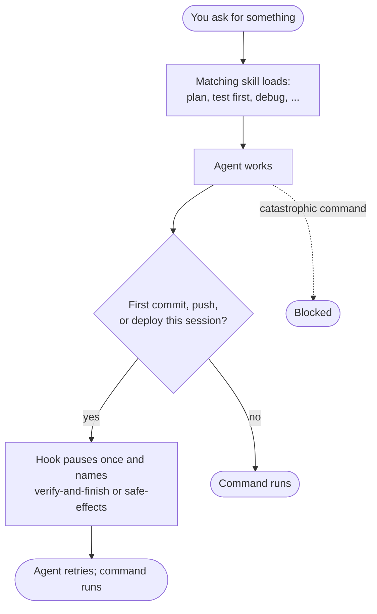

<p align="center">
  
</p>

<h1 align="center">megapowers</h1>

<p align="center">
  Plan, test, debug, and ship with more care in Claude Code and Codex.<br>
  One plugin, 16 skills, and safety hooks. About 1.5k tokens per session.
</p>

<p align="center">
  <a href="https://github.com/lawzava/megapowers/actions/workflows/ci.yml"></a>
  <a href="https://github.com/lawzava/megapowers/tags"></a>
  <a href="./LICENSE"></a>
</p>

<p align="center">
  <a href="#install">Install</a> ·
  <a href="#what-changes-when-it-is-installed">What changes</a> ·
  <a href="#why-megapowers">Why megapowers</a> ·
  <a href="#skills">Skills</a> ·
  <a href="#documentation">Docs</a>
</p>

Coding agents are fast, but they can skip steps: edit before they know the
cause, say "done" without re-running the tests, or push and deploy without a
second look. megapowers gives Claude Code and Codex a skill (a short
playbook) for each of those moments. When your request matches one, the agent
is reminded to load it and follow it. Before the first commit or deploy in a
session, a hook pauses once and names the skill to load first.

It is exactly one plugin for Claude Code and Codex. It uses each tool's own
agents, permissions, worktrees, and memory, and ships no daemon, scheduler,
model router, formatter, or status line.

## What changes when it is installed

| You ask | What the agent does |
|---|---|
| "Why is this test flaky?" | `systematic-debugging`: finds the root cause before editing anything |
| "Add rate limiting to the API" | `test-first-implementation`: writes a failing test, sees it fail, then makes it pass |
| "Commit this and open a PR" | The first commit in the session pauses once and points the agent to `verify-and-finish`, which has it re-run your checks and report what actually passed |
| "Deploy to production" | `safe-effects`: confirms the exact target with you, then reads the result back |
| "Get a second opinion on this auth change" | `independent-review`: shows you what it will send, then asks a model from a different provider to review it |
| Agent runs `rm -rf ~` or `mkfs.ext4 /dev/sda1` | Blocked before it runs |



Skills guide the agent; they do not force it ([how often they load](#results)).
Only the pause and the command block are enforced, by the hook. Your
repository's own instructions and tools always come first.

## Install

**Claude Code**

```bash
claude plugin marketplace add lawzava/megapowers@release
claude plugin install megapowers@megapowers
```

**Codex**

```bash
codex plugin marketplace add lawzava/megapowers --ref release
codex plugin add megapowers@megapowers
```

Then start a fresh session. You need Go 1.25 or newer on `PATH`; the hooks
compile once into a local cache. Codex asks you to review and trust the hooks
before it runs them, and asks again whenever a release changes them.

**Try it:** ask "check my megapowers setup". The doctor reports the plugin
version, whether the hooks are registered, and whether the output style is
active.

Both installs track the `release` branch, which only moves to signed release
tags, so you never get unreleased `main`. Pinning, install scopes, and
uninstall are in [docs/install.md](./docs/install.md).

## Why megapowers

- **Same behavior on Claude Code and Codex.** One plugin, the same skills, and
  the same Go hook code on both.
- **Checks before you ship.** A hook pauses the first commit, push, PR, or
  deploy in a session once and tells the agent to load the verification or
  side-effect skill. The retry runs as normal.
- **Measured with and without the plugin.** An installed-plugin A/B study
  compared the same tasks with and without megapowers.
  [Results below](#results).
- **Cross-provider review.** `independent-review` sends one artifact to a
  different model vendor and shows you what will be disclosed first.
- **Light by default.** About 1.5k tokens load per session. A skill's full
  text loads only when you need it.

### How it compares

Facts checked on 2026-09-25. Install counts on skills.sh are self-reported by
that site.

| | megapowers | [obra/superpowers](https://github.com/obra/superpowers) | [mattpocock/skills](https://github.com/mattpocock/skills) |
|---|---|---|---|
| Works with | Claude Code and Codex, one plugin, shared hook code | 16 agent tools, including Claude Code, Codex, Cursor, Gemini CLI, and Copilot CLI | Any skills-compatible client through `npx skills add` |
| Get it from | This repository's marketplace | The official Claude Code marketplace and, per its README, the official Codex marketplace | skills.sh, 4.2M installs across the collection |
| What you get | 16 skills, one style, three hooks, a doctor | 14 skills, including brainstorming, writing-plans, executing-plans, subagent-driven-development, TDD, and `diagnosing-superpowers` | Single-purpose skills: `code-review`, `tdd`, `triage`, `diagnosing-bugs`, `handoff`, `writing-for-agents`, `grill-me` (1.2M installs) |
| Published measurements | The A/B study below, with SHA-pinned artifacts | Per-change probe counts in release notes (for example, TDD control 8/10 against treatment 5/10 when a section was cut) and a quorum eval lab | None found in the repository on 2026-09-25 |

Which one fits:

- **superpowers** if you use other agent tools such as Cursor, Gemini CLI, or
  Copilot CLI, or want commercial support. It has official marketplace
  listings on both sides, release notes that quote probe counts per change,
  and a diagnostics skill since v6.4.1 (2026-09-19).
- **mattpocock/skills** if you want to adopt small single-purpose skills one
  at a time through skills.sh. Its `grill-me` is a user-invoked pointer skill,
  which matches the Claude Code docs' advice for skills that over-trigger.
- **megapowers** if you use Claude Code, Codex, or both, and want one plugin
  that behaves the same on each, pauses before the first commit or deploy,
  and publishes with-and-without measurements.

## Skills

Each skill has a short description the agent always sees. The full text loads
only when your request matches. The *experimental* labels come from
[`skills/catalog.json`](./plugins/megapowers/skills/catalog.json).

**Plan and build**

| Skill | Use it when |
|---|---|
| `design-and-plan` | A feature or interface needs a spec, a tradeoff decision, or a step-by-step plan |
| `grill-me` *(experimental)* | You want a plan or idea stress-tested through an interview before any action |
| `test-first-implementation` | Adding or changing behavior, fixing a confirmed bug, or refactoring: red, green, refactor, with each run observed |
| `systematic-debugging` | A bug, flaky test, incident, or regression has an unknown cause |
| `orchestrating` | Independent tasks can run in parallel on the tool's own subagents, each owning different files |

**Ship safely**

| Skill | Use it when |
|---|---|
| `verify-and-finish` | Before saying done, committing, merging, publishing, deploying, or handing off: re-runs the real check |
| `safe-effects` | Before a deploy, message, charge, migration, destructive query, DNS change, or any write that leaves your machine |
| `independent-review` | Security, auth, billing, concurrency, or data-integrity work needs a second opinion from another provider |

**Research, long runs, and writing**

| Skill | Use it when |
|---|---|
| `evidence-research` *(experimental)* | A decision needs evidence from outside the repository |
| `autonomous-run` *(experimental)* | An approved goal must keep going unattended across context resets or sessions |
| `humanizing-prose` | You want human-facing text drafted or edited without filler, and without dropping or inventing facts |
| `writing-agent-instructions` *(experimental)* | You are writing or revising a skill, `AGENTS.md`, or `CLAUDE.md` |

**Setup and upkeep**

| Skill | Use it when |
|---|---|
| `megapowers-doctor` *(experimental)* | A skill did not fire, the style looks off, or a hook errored |
| `upgrading-megapowers` | You want to update, reinstall, or repair the plugin |
| `mcp-setup` *(experimental)* | An MCP server needs installing or fixing, or its tools are missing |
| `memory-hygiene` *(experimental)* | You ask to audit or prune the agent's saved memory (only when you invoke it by name) |

[docs/orchestration.md](./docs/orchestration.md) explains which kinds of task
go to which skill.

## Output style

An optional style that makes replies shorter and more direct: the answer
first, about 100 words by default and up to 250 unless you ask for depth, and
no em dashes. It keeps the built-in coding instructions.

- **Claude Code:** off until you select it. Run
  `/output-style megapowers:Megapowers`, or pick it in `/config` under Output
  style. The setting must read `"outputStyle": "megapowers:Megapowers"`. The
  bare value `Megapowers` does not load the plugin style.
- **Codex:** on once you trust the hooks. The trusted Codex startup hook (`SessionStart`)
  adds the style as developer context on startup, resume, clear, and after
  compaction. Set `MEGAPOWERS_OUTPUT_STYLE=off` before launching Codex to turn
  it off and keep the safety hook.

In one operator's September 2026 Codex sessions, styled final messages had a
median of 70 words, and 0.6 percent contained an em dash, against 36 percent
without the style. These numbers are not a token-saving or cost claim.

## Results

From an installed-plugin A/B study completed 2026-09-05: 1,080 valid trials
over 27 cases, with ten control/treatment pairs per case on each tool. The
control ran without the plugin and the treatment ran with it. Codex ran
`gpt-6-astra` on CLI `0.153.3`, and Claude ran `claude-fable-5-1` on Claude
Code `2.1.258`, both at high effort.

| Task checks passed | Codex without | Codex with | Claude without | Claude with |
|---|---:|---:|---:|---:|
| 18 development cases | 85/180 | 106/180 | 89/180 | 101/180 |
| 6 held-out cases, frozen before the run | 50/60 | 60/60 | 52/60 | 53/60 |

With the plugin installed, the skill a task needed loaded in 77 of 150 Codex
trials and 83 of 150 Claude trials, so skills help but do not always fire.
The study predates the `0.29.0` version stamp. Neither tool passes the
full benchmark, and the results do not show general model superiority. Full
results and method: [evals/RESULTS.md](./evals/RESULTS.md).

<details>
<summary>More results and caveats</summary>

| Development checks (18 cases) | Codex control | Codex + megapowers | Claude control | Claude + megapowers |
|---|---:|---:|---:|---:|
| Task outcome | 85/180 | 106/180 | 89/180 | 101/180 |
| Workflow | 163/180 | 170/180 | 164/180 | 169/180 |
| Outcome and exact activation profile | 85/180 | 74/180 | 89/180 | 73/180 |
| Required activation profile | n/a | 77/150 | n/a | 83/150 |

"Required activation profile" scores whether the skill a case requires
actually loaded, as shown in the trace. It is scored apart from task outcome.
"Outcome and exact activation profile" also requires the exact expected set of
skill reads, so an extra successful skill read can fail it. On this row
treatment scores below control on both tools.
All ten Claude pending-review replies passed the task checks but did not load
`verify-and-finish`. The instruction-authoring case moved from 0/10 to 10/10
on Codex and 0/10 to 9/10 on Claude. Codex's pending-review case moved from
0/10 to 10/10. The separate autonomy/continuity diagnostics did not pass
(Codex 0/30 to 0/30, Claude 1/30 to 0/30).

The 2026-09-02 Codex trigger-recall run reported 0/117 implicit recall despite
a rendered catalog
([trigger-recall README](./evals/studies/trigger-recall/README.md)), so on
Codex the skill-trigger checks only report and never fail a run.
`scripts/validate.sh` and `evals/run-all.sh` prove repository mechanics, not
agent quality. Protocols are in [docs/advanced/evals.md](./docs/advanced/evals.md).

</details>

## Cost

About 1,470 tokens per session on Claude Code and about 1,510 on Codex, for
the style, startup hook text, and skill list (word-count estimate from
installed session text, 2026-09-25, outside this repository). Each skill body
is 201 to 417 words and loads only when that skill is used.

<details>
<summary>Exactly what installs</summary>

- 16 skills under `skills/`, listed in `skills/catalog.json`.
- One output style, `output-styles/megapowers.md`, shared by both tools.
- Go hooks on three events, compiled once into a local cache:
  - `SessionStart`: a reminder to load a matching skill before acting, plus the
    style on Codex.
  - `SubagentStart`: the same reminder and a compact report contract for
    subagents: lead with the result, cite `file:line` or command evidence, no
    padding, no em dashes.
  - `PreToolUse` on Bash and PowerShell: denies a narrow set of catastrophic
    commands. The first `git commit`, `git push`, or `gh pr create` in a
    session stops once and names `verify-and-finish`, and the first publish,
    deploy, or `gh` command that writes to GitHub stops once and
    names `safe-effects`; the retry runs. A skill already loaded in the
    transcript skips the stop, and without a session ID the hook only adds a
    reminder. A git command that discards uncommitted, stashed, or unmerged
    work (`reset --hard`, a forced `clean`, a forced or whole-tree `checkout`,
    a whole-tree `restore`, `branch -D`, `stash drop` or `clear`) stops once
    per exact command with a reminder to check `git status` first.
- Two Go standard-library tools that load only with their skill: the
  memory-audit validator for `memory-hygiene` and the review packager for
  `independent-review`.
- A `doctor` command behind `megapowers-doctor`.

The plugin does not edit global user configuration and supplies no model,
provider, or agent configuration. For non-trivial delegation, `orchestrating`
can read an optional personal registry at
`~/.config/megapowers/agent-capabilities.md`; it is advisory and grants no
access.

</details>

## Troubleshooting

Start with the doctor: `/megapowers:megapowers-doctor` on Claude Code, or the
skill name after `$` as it appears in the Codex skills list. It runs
`run-hook.cmd doctor` and reports the plugin version and root, which tool is running,
the Go toolchain version against the cached runner, the Claude `outputStyle`
value in effect, whether the hooks are registered, and how to see whether a
skill fired in your transcripts.

| Symptom | Fix |
|---|---|
| Style not applied on Claude Code | The setting must read `megapowers:Megapowers`, not `Megapowers` |
| Hooks silent on Codex | Trust the plugin hooks when prompted; a release that changed them prompts again |
| Hook error mentioning Go | Install Go 1.25 or newer, or clear the cached runner the doctor names |
| Wrong version after an upgrade | Use `upgrading-megapowers`, which compares the marketplace head with the approved release tag before writing |

## Limits

- Skills are instructions, not enforcement. Model and tool behavior change.
- The style cannot suppress tool-result rendering. Codex skips the hooks until
  you trust them.
- The destructive-command hook matches a narrow set of command strings,
  including compound commands and absolute-path wrappers. OS sandboxing and
  least privilege remain the real boundary. See [SECURITY.md](./SECURITY.md).
- Independent review sends the source you approve to the selected provider.
  It rejects common secret patterns, not every possible secret.
- The evaluation studies that call real models cost money and need a reviewed
  credential broker. Their self-tests do not replace a real run.
- Only current Claude Code and Codex are supported. Exact boundaries are in
  [docs/harness-support.md](./docs/harness-support.md).

## Documentation

- [Install, pin, update, uninstall](./docs/install.md)
- [Harness support and freshness](./docs/harness-support.md)
- [Orchestration and task shapes](./docs/orchestration.md)
- [Independent review workflow](./docs/advanced/independent-review.md)
- [Evaluation and release evidence](./docs/advanced/evals.md)
- [Verification maps](./docs/advanced/verification-maps.md)
- [Security policy](./SECURITY.md), [Contributing](./CONTRIBUTING.md),
  [Changelog](./CHANGELOG.md)

## Develop

```bash
scripts/validate.sh
bash evals/run-all.sh --json results.jsonl
```

The deterministic suite fails on malformed, incomplete, indeterminate,
timed-out, or harness-error results. Changes to behavioral guidance need
deterministic regression coverage. See [CONTRIBUTING.md](./CONTRIBUTING.md).

## License and origin

megapowers is MIT-licensed. It began from Superpowers by Jesse Vincent and
retains other source credits in [ATTRIBUTION.md](./ATTRIBUTION.md). It is not an
Anthropic or OpenAI product.
